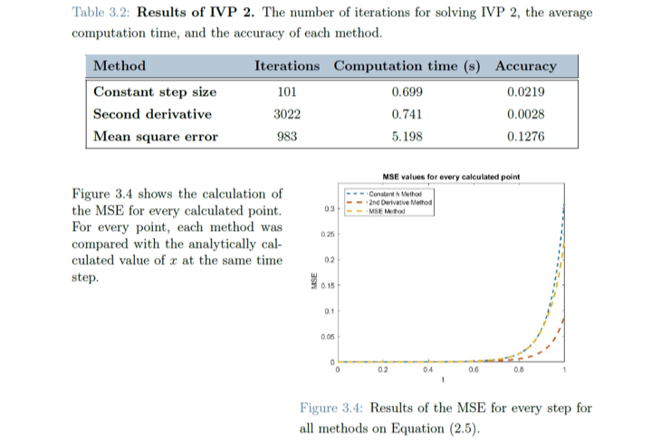

<h1 style=align="center">Numerical IVP Solver</h1>

<i>This MATLAB project implements and compares numerical solvers for solving initial value problems</i>

 
 
This was a group project for a Numerical Method of Simulation course. It involved implementing and comparing the efficiency and accuracy of three different numerical methods for solving initial value problems(IVPs). The algorithms were implemented and the results were compared using the MATLAB programming language. The code is annotated and presented in detail, in a clear and easy-to-follow format. Three methods were compared: 
- a constant step size implicit Euler solver using the Newton-Raphson method,  
- an adaptive step size algorithm based on the ratio between the first and second derivative,  
- and an adaptive step size algorithm based on minimizing the mean square error(MSE). 
 
The report presents a thorough discussion of the results for three different test IVPs, along with their analytical solutions for comparison. The report also includes a critique of the results and suggestions for future research. In each case, the adaptive step size algorithms produced more accurate results than the constant step size method, with the MSE-based algorithm generally requiring the fewest iterations and resulting in the fastest computation time. The adaptive step size algorithms produced more accurate results than the constant step size method, with the algorithm based on the second derivative showing the greatest improvement in accuracy, albeit at the cost of longer computation time. The algorithm based on minimizing the mean square error showed similar accuracy to the constant step size algorithm but required fewer iterations and was faster.  
 
Overall, the project provides a useful analysis of different numerical methods for solving IVPs. The authors of the report present their results clearly and thoroughly, and provide valuable insights into the strengths and weaknesses of each method. The code could be a valuable resource for other researchers or students interested in implementing these methods in their own work. 
 
This project is released under the Creative Commons Attribution-ShareAlike 4.0 International license. This license allows reusers to distribute, remix, adapt, and build upon the material in any medium or format, even for commercial purposes. However, it requires that reusers give credit to the creator(s), and it requires that any remixes, adaptations, or modifications of the material, must be licensed under identical terms. In other words, give us credit for our work and keep the project open source.

Author
--
 
Aaron Jay Hinkle
 
Sophia Felicia Salome Döring
 
 
Rhine-Waal University of Applied Sciences
 
https://www.hochschule-rhein-waal.de/en

License
--

This project and all the work in this repository is released under the following open source license:

Creative Commons Attribution-ShareAlike 4.0 International, CC BY-SA 4.0